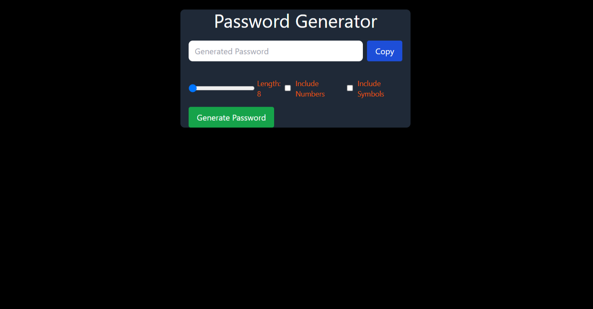
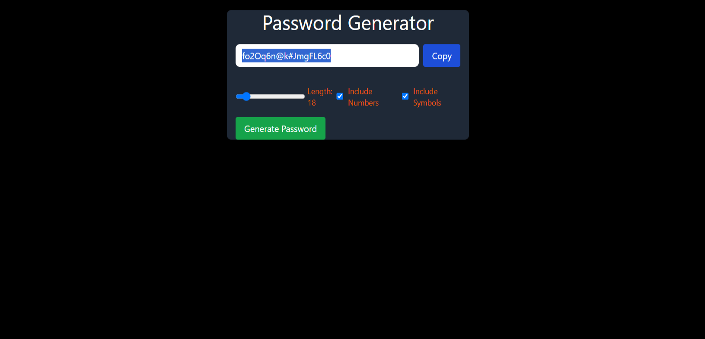

## **Password Generator**

A simple and responsive **Password Generator** built using **React**. This application allows users to generate secure passwords of customizable lengths and includes options to use **numbers** and **special characters**. Additionally, it provides a **copy to clipboard** feature with a smooth popup notification confirming the password has been copied.

---

### **Demo UI**
  
*UI of the password generator interface.*

---

### **Generated Password Example**
  
*A sample generated password being copied to the clipboard.*

---

## **Features**
- Generate passwords of **custom lengths** (between 8 to 100 characters).
- Toggle options to **include numbers** and **special characters**.
- **Copy to clipboard** functionality with a popup confirmation.
- **Responsive design** with a neat UI.

---

## **How to Use**
1. Adjust the **password length** using the slider.
2. Select checkboxes to **include numbers** or **symbols**.
3. Click the **Generate Password** button.
4. Once the password is generated, click the **Copy** button to copy it to the clipboard. A popup will confirm the copy action.

---

## **How to Run the Project Locally**

1. **Clone the repository:**
   ```bash
   git clone https://github.com/your-username/password-generator.git
   ```
2. **Navigate into the project directory:**
   ```bash
   cd password-generator
   ```
3. **Install dependencies:**
   ```bash
   npm install
   ```
4. **Run the project:**
   ```bash
   npm start
   ```
5. Open your browser and navigate to `http://localhost:3000`.

---
