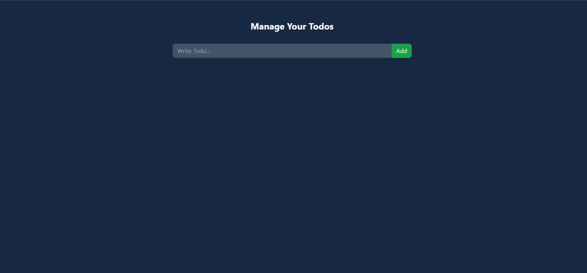

# **To-Do List App**

A simple React-based To-Do List application where users can add, update, toggle, and delete tasks. The app also persists the list in `localStorage` so tasks remain even after refreshing or closing the browser.



## **Features**
- Add new to-dos.
- Edit existing to-dos.
- Mark to-dos as completed (toggle).
- Delete to-dos.
- Persist tasks in `localStorage` to maintain them across sessions.

## **Technologies Used**
- **React**: Frontend JavaScript library used for building the user interface.
- **TailwindCSS**: Utility-first CSS framework for styling.
- **localStorage**: For persistent data storage on the user's browser.

## **Installation and Setup**

1. **Clone the repository**:
   ```bash
   git clone https://github.com/your-username/todo-list-app.git
   ```

2. **Navigate to the project folder**:
   ```bash
   cd todo-list-app
   ```

3. **Install dependencies**:
   Ensure you have [Node.js](https://nodejs.org/) installed, then run:
   ```bash
   npm install
   ```

4. **Run the app**:
   ```bash
   npm start
   ```

   This will launch the app on `http://localhost:3000/` or `http://localhost:5173/`.

## **App UI Overview**

### **1. To-Do List Interface**
This interface allows users to manage their tasks easily. You can add new tasks using the input field, mark them as completed, or delete them.


### **2. Add a Task**
- Enter a task in the input field and press "Add."
- The task will appear in the list below.

### **3. Edit a Task**
- Press the pencil (✏️) icon next to a task to edit it.
- Press the folder (📁) icon to save the updated task.

### **4. Mark a Task as Completed**
- Click the checkbox next to the task to toggle its completion status. Completed tasks will appear with a line through them.

### **5. Delete a Task**
- Click the ❌ icon to delete a task from the list.


## **Future Improvements**
- Add due dates to tasks.
- Add a filtering feature to show only completed or active tasks.
- Integrate with a backend API for cloud storage of tasks.

